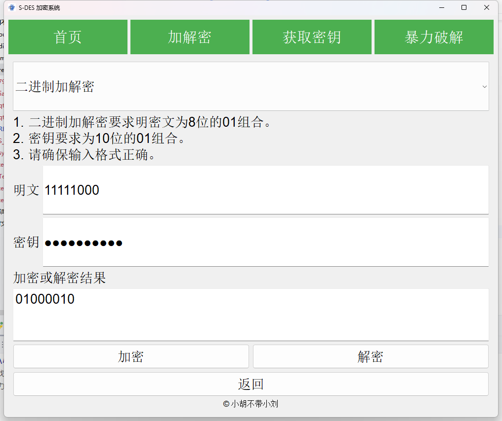
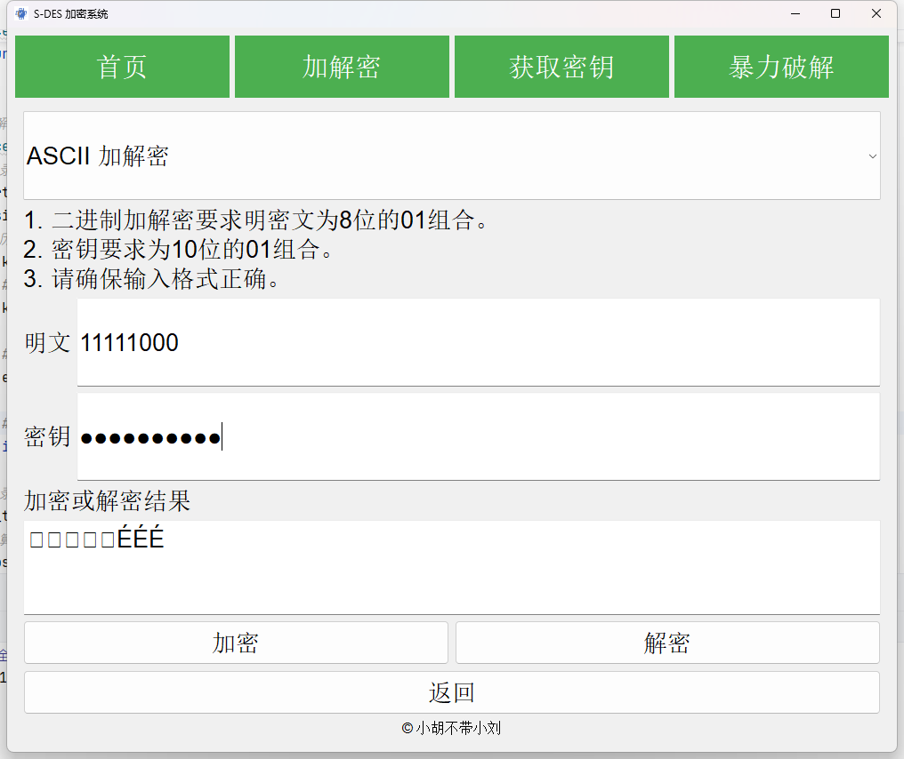
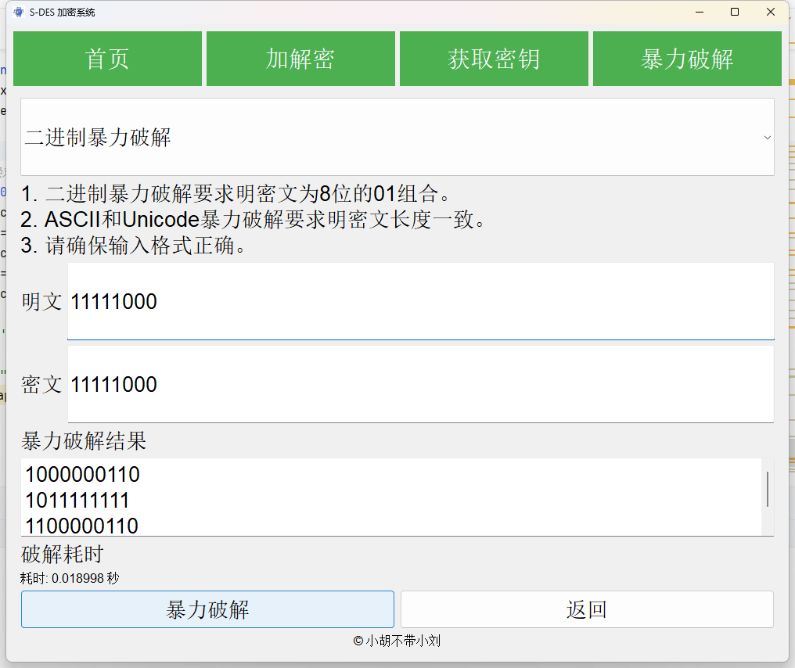
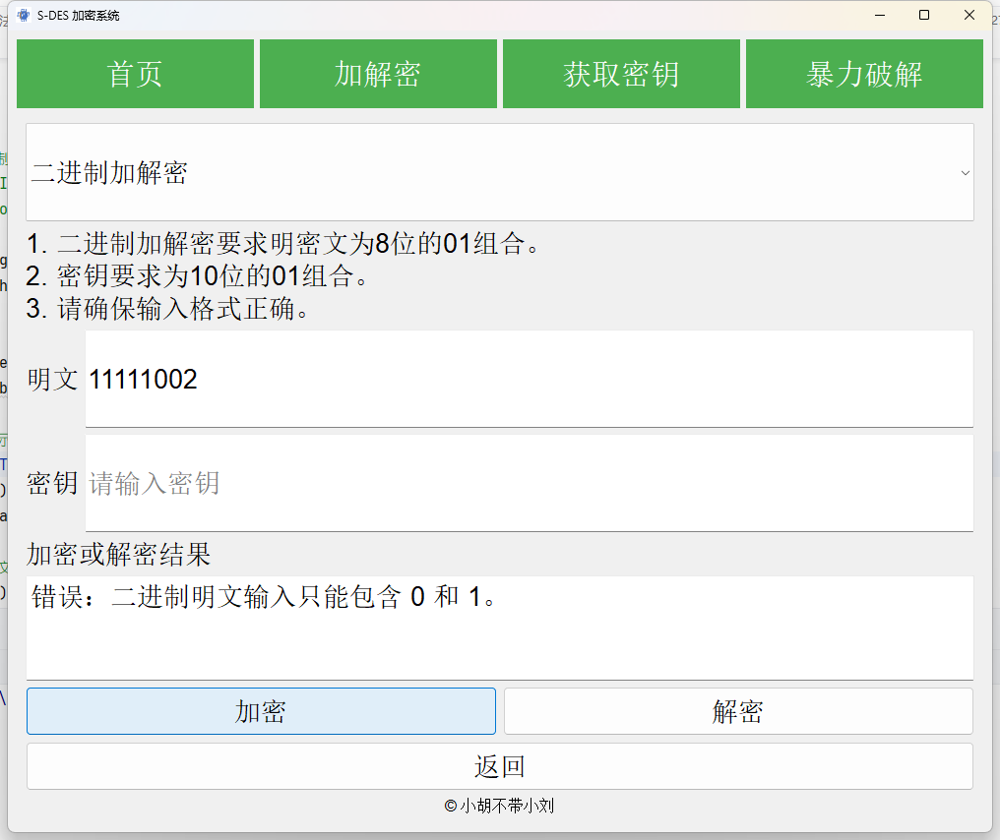
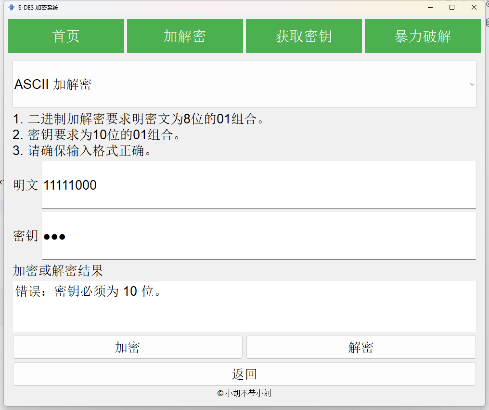
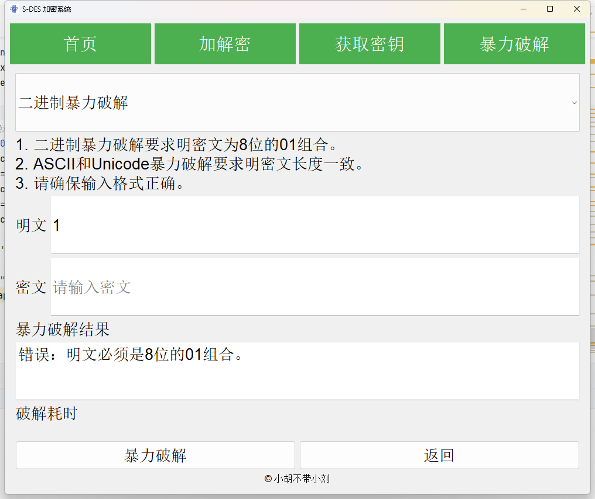

# 用户指南 - S-DES系统

## 1. 系统简介

S-DES系统是一款专为用户设计的工具，旨在为您提供高效、快速的8-bit二进制数、ASCII字符和Unicode字符的加密与解密服务。通过一个直观的应用，即使是小白也可以轻松上手。

## 2. 环境配置

### 2.1 安装Python

请确保您的计算机上已经安装了Python 3.10。您可以通过访问Python的官方网站来下载并安装。

### 2.2 安装依赖

1. 打开命令提示符或终端。
2. 切换到系统的根目录。
3. 输入并执行以下命令来安装必要的依赖包：

```sh
pip install -r requirements.txt -i https://mirrors.tuna.tsinghua.edu.cn/pypi/web/simple
```

## 3. 启动系统

在终端，执行以下命令：

```sh
python qtWin.py
```

可进入系统的主界面。或者直接下载并且双击我们的S-DES.exe。

## 4. 主界面介绍

系统的界面分为几个主要区域：

- **首页**：首页，有S-DES的流程图。
- **加密解密区**：用户可以选择需要加密解密的内容类型（8位二进制数、ASCII字符或Unicode字符），并进行相应的加解密操作。
- **密钥生成**：如果双方想要确定一个随机密钥，可以使用这个功能尝试获取它。
- **暴力破解**：如果您忘记了密钥，可以使用这个功能尝试获取它。
  

## 5. 如何使用

### 5.1 8位二进制数加解密

1. 在主界面中，定位到“加解密”按钮。
2. 默认的是8位二进制数加解密，所以不用更改。
3. 在提供的输入框中，输入您的8位二进制数。
4. 选择您希望进行的操作：“加密”或“解密”。
5. 在下方，您会看到一个输出框展示结果。


### 5.2 ASCII字符加解密

1. 点击“二进制加解密选项”，定位到“ASCII加解密”选项。
2. 在输入框中，键入您需要加密或解密的ASCII字符。
3. 选择“加密”或“解密”按钮。
4. 输出结果将会在下方的区域展示。
   


### 5.3 Unicode字符加解密

1. 点击“二进制加解密选项”，定位到“Unicode加解密”选项。
2. 在输入框中，键入您需要加密或解密的Unicode字符。
3. 选择“加密”或“解密”按钮。
4. 输出结果将会在下方的区域展示。
   


### 5.4 获取密钥

1. 如果双方没有确定密钥，可以转到“获取密钥”区域。
2. 点击“生成密钥”就可以生成随机的密钥。
3. 务必保存好密钥。
 


### 5.5 暴力破解

1. 如果您遗失了密钥，转到“暴力破解”区域。
2. 输入二进制数、ASCII字符或者是Unicode字符的明文和密文。
3. 点击“开始破解”。
4. 系统将遍历所有可能的密钥组合，在找到正确的密钥后在下方输出，并且输出破解时间。
    


## 6. 开发手册

对于高级用户或希望自动化一些过程的用户，我们提供了开发手册。详情请参考随附的“[开发手册.md](开发手册.md)”文件。

## 7. 故障排查

### 7.1 无法启动系统

- 确保Python版本为3.10。
- 确保所有依赖都已经正确安装。
- S-DES.exe文件是打包好的应用程序，无须配置环境，如打不开请及时联系开发人员。

### 7.2 加解密出错

- 二进制加解密要求明密文为8位的01组合。
- 密钥要求为10位的01组合。
- 请确保输入格式正确。
#### 错误实例
 
 
 
 
 

### 7.3 暴力破解出错
- 二进制暴力破解要求明密文为8位的01组合。
- ASCII和Unicode暴力破解要求明密文长度一致。
- 请确保输入格式正确。
- 如果问题持续，请联系我们的技术支持。
#### 错误实例
 
 
