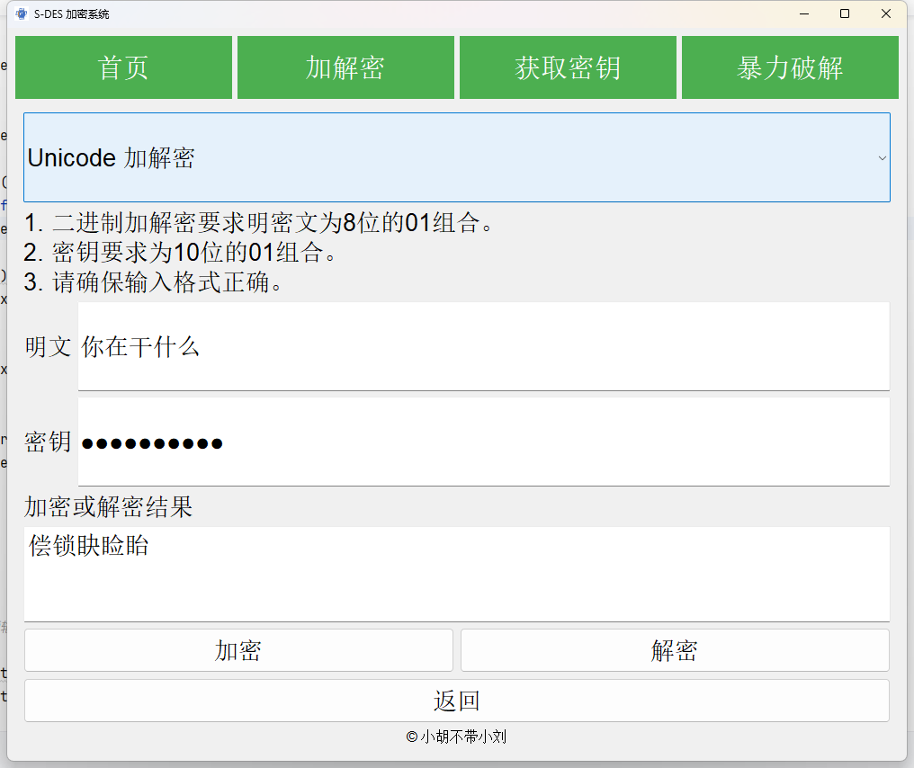

# 开发手册

  S-DES系统是一款专为用户设计的工具，旨在为您提供高效、快速的8-bit二进制数、ASCII字符和Unicode字符的加密与解密服务。通过一个直观的应用，即使是小白也可以轻松上手。

## S-DES算法流程

  

## 项目结构

```markdown
├── img                             - 存放代码图片
├── result_img                      - 存放结果图片
├── qtWin.py                        - 界面实现
├── S_DES.py                        - S-DES算法实现
├── requirements.txt   
├── 开发手册.md                         
├── 用户指南.md    
└── S-DES.exe   
```

## 主要函数
```python
# 子密钥的生成
def subKey(input):
# 初始置换函数
def permute(input):
# 最终置换函数
def finalPermute(input):
# 二进制转换(S-BOX)
def binary(a):
# 轮函数，输入的值分别为处理后的明文和子密钥
def round_function(Text, k):
# 左右互换SW，输入一段8-bit的密文，函数会将其左右4-bit的内容调换
def swapper(input):
# 加密函数
def encrypt(plainText,key):
# 解密函数
def decrypt(cipherText,key):
# 加密ASCII函数
def encryptASC(plainText,key):
# 解密ASCII函数
def decryptASC(cipherText,key):
# unicode转换为二进制
def unicode2binary(unicode_str):
# 加密unicode函数
def encryptUnicode(unicode_str, key):
# 解密unicode函数
def decryptUnicode(unicode_str, key):
# 暴力破解二进制
def force(plainText, cipherText):
# 暴力破解ASCII
def forceASC(plainText, cipherText):
# 暴力破解unicode
def forceUnicode(plainText, cipherText):
# 获取密钥函数
def generate_key(length):
# 居中页面函数
def center(self):
```

## 第1关：基本测试

- 根据S-DES算法编写和调试程序，提供GUI解密支持用户交互。输入可以是8bit的数据和10bit的密钥，输出是8bit的密文

### 主界面

- 可以选择不同的功能，包括**首页，加解密，获取密钥，暴力破解**
  

### 加解密操作

- 密钥采用隐式显示，测试使用密钥为***1111100000***

- 二进制选项

    

### 获取密钥操作

- 使用python的secrets模块获取随机密钥，提供的函数可以获取长度不同的密钥，S-DES获取10-bit密钥

```python
# 获取密钥函数
def generate_key(length):
    key = secrets.randbits(length)
    # 转为二进制，左零补全为10-bit
    key_bin = bin(key).replace('0b', '').zfill(10)
    return key_bin
```

 

## 第2关：交叉测试

- 考虑到是**算法标准**，所有人在编写程序的时候需要使用相同算法流程和转换单元(P-Box、S-Box等)，以保证算法和程序在异构的系统或平台上都可以正常运行。
- 设有A和B两组同学(选择相同的密钥Key)；则A、B组同学编写的程序对明文PlainText进行加密得到相同的密文CipherText；或者B组同学接收到A组程序加密的密文CipherText，使用B组程序进行解密可得到与A相同的PlainText。

     - **A组**
 
    
    
    
  
     - **B组**
      
    
    
    

## 第3关：扩展功能

- 考虑到向实用性扩展，加密算法的数据输入可以是ACSII编码字符串(分组为1 Byte)，对应地输出也可以是ACII字符串；也有可能是Unicode，对应地输出也可以是Unicode(很可能是乱码)。

### 功能实现

- GUI界面提供了二进制加解密、ASCII加解密、Unicode加解密的按钮，选择可以切换加解密模式，ASCII模式下输出密文为ASCII对应的字符串，Unicode模式下输出密文为Unicode对应的字符串。
- 通过对按钮的选择切换模式，对于ASCII编码格式，对于每个字符转为二进制单独处理，最后整合获取的结果显示在相应的位置；对于Unicode编码格式，对于每个字符转为16位的二进制数，分成左右两边分别进行加密，最后合并为一个Unicode。

```python
        # 使用下拉框实现功能的变换
        self.combo_box1 = QComboBox()
        self.combo_box1.addItem("二进制加解密")
        self.combo_box1.addItem("ASCII 加解密")
        self.combo_box1.addItem("Unicode 加解密")
        self.combo_box1.setFont(font)
        self.combo_box1.setMinimumHeight(100)
        self.combo_box1.currentIndexChanged.connect(self.change_endecryption_type)

        # 初始设置位二进制加解密
        self.change_endecryption_type(0)
```

```python
# 加密ASCII函数
def encryptASC(plainText,key):
    encrypted_text = ''
    for char in plainText:
        binary_text = format(ord(char), '08b')
        k1 = subKey(key)[0]
        k2 = subKey(key)[1]
        ip = permute(binary_text)
        fk1 = round_function(ip, k1)
        sw = swapper(fk1)
        fk2 = round_function(sw, k2)
        ip_reverse = finalPermute(fk2)
        ip_str = ''.join(str(i) for i in ip_reverse)
        encrypted_text += chr(int(ip_str, 2))
    return encrypted_text
```

```python
# unicode转换为二进制
def unicode2binary(unicode_str):
    binary_list = []
    for char in unicode_str:
        unicode_val = ord(char)  # 获取字符的 Unicode 值
        binary_str = format(unicode_val, '016b')  # 转换为 16 位二进制字符串
        binary_list.append(binary_str)  # 存储二进制字符串
    return binary_list
```

- ASCII选项

   

- Unicode选项

   

## 第4关：暴力破解

- 假设你找到了使用相同密钥的明、密文对(一个或多个)，可以尝试使用暴力破解的方法找到正确的密钥Key。设定时间展示了我们在多长时间内完成了暴力破解。

### 破解操作

- 采用**遍历**进行破解，比对获取的密文和截取的密文输出破解成功的密钥，同时会输出破解所花费的时间

```python
# 暴力破解unicode
def forceUnicode(plainText, cipherText):
    # 记录开始时间
    start_time = time.time()
    possible_keys = []
    # 遍历所有10位二进制密钥
    for key_int in range(1024):
        # 生成10位二进制密钥
        key = format(key_int, '010b')

        # 使用当前密钥对明文加密
        encrypted_text = encryptUnicode(plainText, key)

        # 判断是否与给定的密文匹配
        if encrypted_text == cipherText:
            possible_keys.append(key)
    # 记录结束时间
    end_time = time.time()
    # 计算并打印程序运行时间
    elapsed_time = end_time - start_time
    # 打印破解结果
    if possible_keys:
        print(f"已找到密钥: {possible_keys}")
    else:
        print("未找到任何密钥")

    print(f"暴力破解完成, 耗时: {elapsed_time:.6f} 秒")

    return possible_keys,elapsed_time
```

- 破解过程是将截取的明文通过划分的密钥进行加密，比对获取的密文是否正确


- 二进制选项

    

- ASCII选项

   

- Unicode选项

   

## 第5关：封闭测试

- 根据第4关的结果，进一步分析，对于你随机选择的一个明密文对，是不是有不止一个密钥Key？进一步扩展，对应明文空间任意给定的明文分组P~n~，是否会出现选择不同的密钥K~i~ ≠ K~j~加密得到相同密文C~n~的情况？

|    明文    | 密文     |  加密使用的密钥   |     破解的密钥      |  破解时间  |
|:--------:| -------- |:----------:|:--------------:|:------:|
| 11111001 | 00000000 | 1111100000 | **1111100000** | 0.020s |
|          |          |            |   1010101110   |        |
|          |          |            |   1011100000   |        |
|          |          |            |   1110101110   |        |
| 00000000 | 11111010 | 1010101010 | **1010101010** | 0.020s |
|          |          |            |   1001110000   |        |
|          |          |            |   1101110000   |        |
|          |          |            |   1110101010   |        |
| abcdefgh | R‡È¢×\ | 1111100000 | **1111100000** | 0.16s  |
|          |          |            |   1011100000   |        |
| xiaohubudaixiaoliu | w¹\ÿÿ‡ww¹=wÿ | 1111100000 | **1010101010** | 0.35s  |
|          |          |            |   1011100000   |        |
| 小胡不带小刘 | 簫뀨ᩢ퀜 | 1010101010 | **1010101010** | 0.24s  |
|          |          |            |   1110101010   |        |
| 今天天气真好，可以一玩，玩则请从 | 睔꾸꾸푡ﶛ꽢앨ゞ瞤睧堞앨堞뼛쎻矱 | 0000011111 | **0000011111** | 0.62s  |
|          |          |            |   0100011111   |        |


## 总结
- 本次作业是实现简单的DES系统，算法本身已经简化了，实现算法较为简单，笔者认为难的部分在于可视化界面的设计，包括页面的设计、页面的跳转、读取输入、报错提
示以及显示结果等等。如果说还可以继续改进的话（指只在S-DES的基础上），理论上可以设计手动输入置换盒，替换盒，轮函数和移位的一些细节，或者说改变密钥空间（
从10位拓展为20位），可以增强安全性（但是会存在时间代价）。这就很让日期待后面会学到的AES了。


## 特别鸣谢
 - 小组：小胡不带小刘
 - 成员：刘肖、胡力文
 - 若有任何疑问或建议，请联系开发团队：1065098732@qq.com